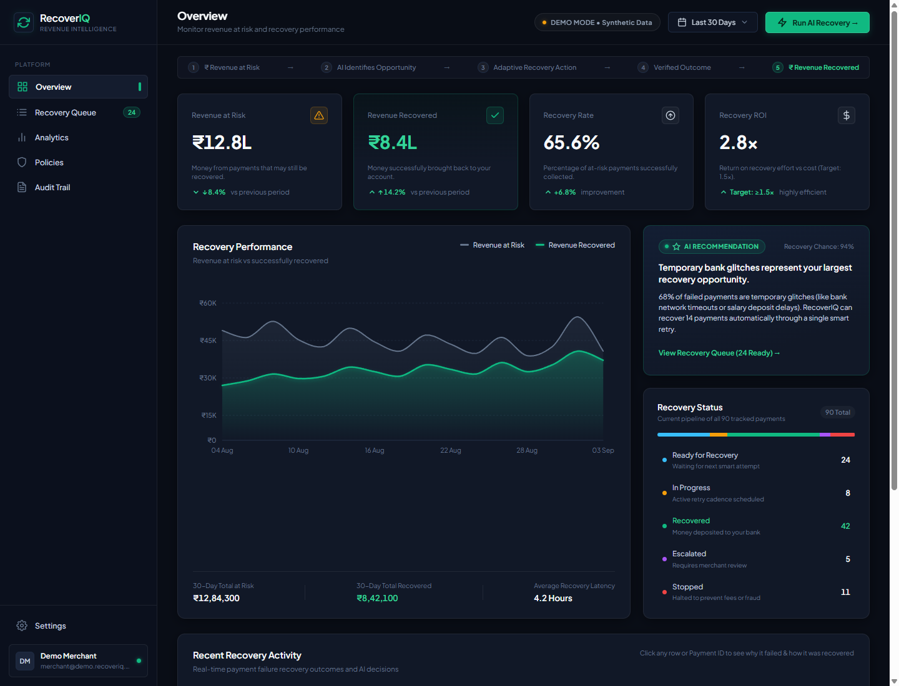
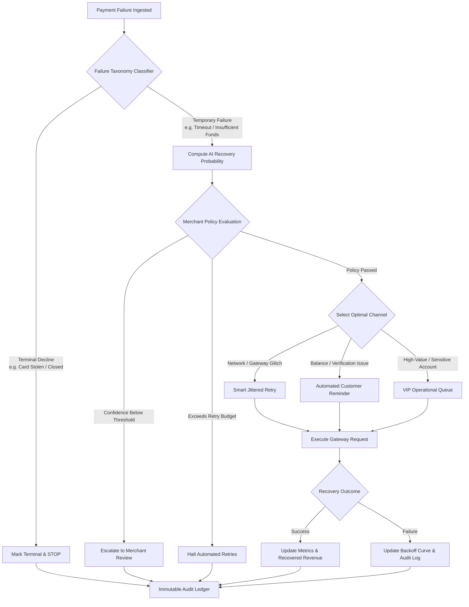
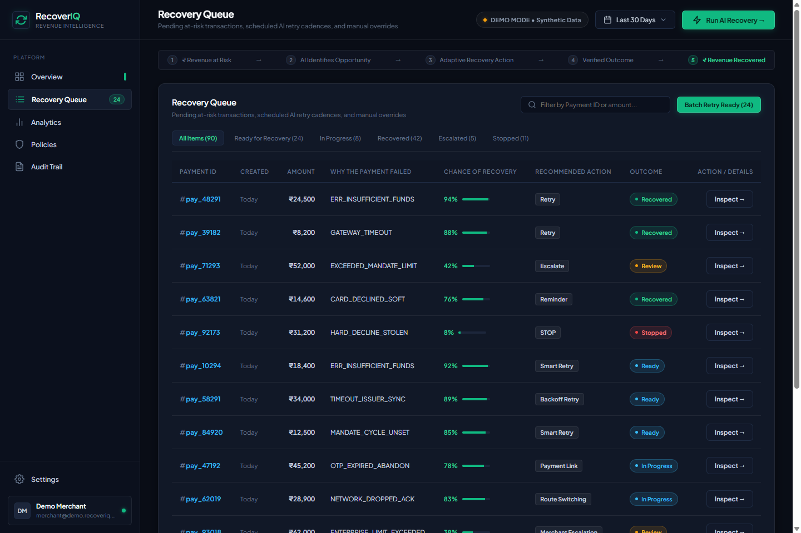
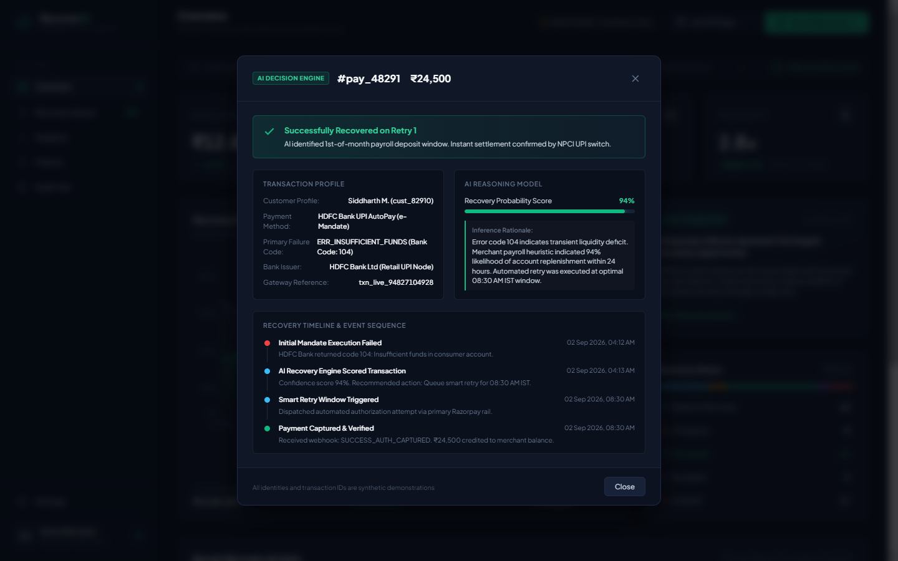
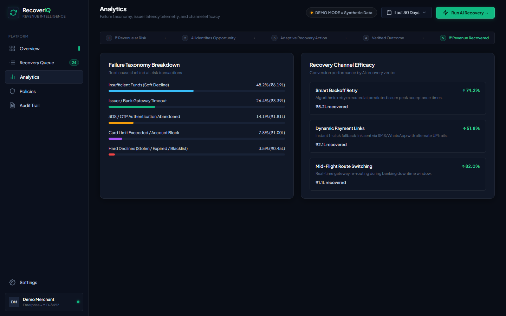
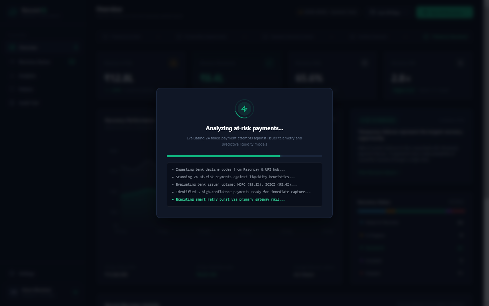
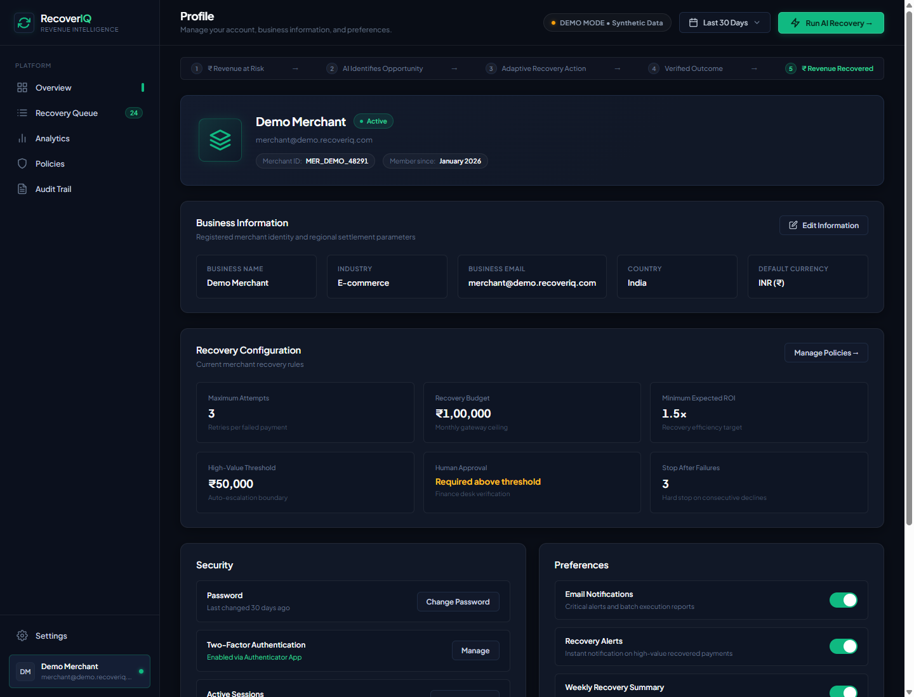
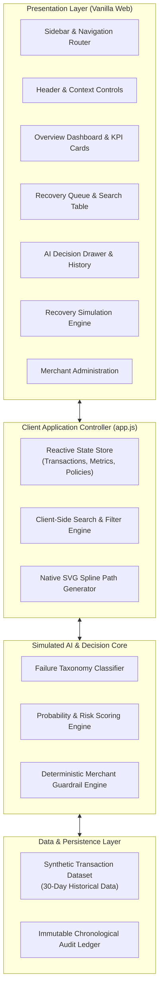

# RecoverIQ — AI-Powered Revenue Recovery for Merchants

[](LICENSE)
[](#project-status)
[-lightgrey.svg)](#tech-stack)
[](#demo-data--safety)

> **Intelligent revenue recovery control center helping merchants diagnose payment failures, predict recovery likelihood, and orchestrate policy-guided recovery actions before revenue is lost.**

---

> [!NOTE]
> **DEMO MODE • Synthetic transaction data**  
> RecoverIQ is currently configured in demonstration mode with synthetic payment transaction data. No real customer PII, payment card details, or live banking credentials are stored, processed, or transmitted.

---

## Overview



Involuntary payment failure is one of the single largest sources of unforced revenue loss for modern subscription, SaaS, and digital commerce businesses. When a customer payment fails—whether due to temporary bank downtimes, insufficient balances, issuer processing limits, or network timeouts—merchants typically face a difficult dilemma:

* **Blindly retrying** payments irritates issuing banks, risks elevated gateway decline fees, and can trigger merchant fraud rate warnings.
* **Aggressive dunning emails** introduce customer friction, damage customer relationships, and increase involuntary churn.
* **Manual operations** cannot scale across thousands of recurring subscription cycles and invoice settlements.

**RecoverIQ** introduces an intelligent, policy-governed control layer between payment gateway decline events and recovery execution. By categorizing failures into temporary vs. terminal decline taxonomies, computing recovery probability scores, and enforcing merchant guardrails, RecoverIQ enables businesses to recover trapped revenue systematically while protecting issuer standing and customer trust.

---

## The Problem

```
┌────────────────────────────────────────────────────────────────────────┐
│                      Traditional Recovery Failure                      │
├───────────────────┬────────────────────────────────┬───────────────────┤
│    Blind Retries   │      Aggressive Dunning        │   Manual Spreadsheets │
│  Gateway penalties│    Customer annoyance & churn  │   Unscalable & slow   │
│  Issuer blacklists│    Damaged merchant reputation │   High revenue leak   │
└───────────────────┴────────────────────────────────┴───────────────────┘
```

Payment failures are not homogenous, yet most dunning and recovery tooling treats them identically:

1. **Lack of Failure Taxonomy**: A failure caused by an issuer maintenance window requires an immediate retry with backoff, whereas an invalid account number or lost card should never be retried automatically.
2. **Timing Insensitivity**: Attempting to charge an account with insufficient balance on the 28th of the month often fails, whereas retrying shortly after standard salary credit cycles (1st to 5th) succeeds with high probability.
3. **Absence of Operational Boundaries**: Without strict policy guardrails, automated systems risk runaway retries, exceeding card scheme compliance thresholds (such as Visa/Mastercard retry guidelines).
4. **Poor Observability**: Finance and operations teams rarely have a single, unified view of revenue at risk, recovery rates, and the specific reasons why recoveries succeeded or failed.

---

## The Solution

> **"AI recommends. Merchant rules decide."**

RecoverIQ operates on the principle that machine intelligence should provide precise diagnostic understanding and probability ranking, while deterministic merchant policies establish absolute boundaries for execution.

```
Failed Transaction Event
          │
          ▼
   [ Failure Diagnostics ] ── Classification (Temporary vs. Terminal)
          │
          ▼
   [ Recovery Scoring ]    ── ML Confidence & Expected Recovery Value
          │
          ▼
   [ Merchant Guardrails ] ── Enforce Max Retries, Cooldowns & Thresholds
          │
          ▼
   [ Bounded Action ]      ── Smart Retry / Customer Reminder / Escalation
          │
          ▼
   [ Outcome Ledger ]      ── Full Audit Trail & Recovery Verification
```

* **Intelligent Diagnostics**: Identifies failure root causes across card network decline codes, UPI e-mandates, and gateway timeout telemetry.
* **Predictive Recovery Scoring**: Calculates a recovery likelihood percentage based on transaction amount, issuer behavior, customer history, and failure reason.
* **Merchant-Defined Policies**: Configurable retry budgets, cooldown windows, and minimum confidence thresholds prevent unauthorized or risky actions.
* **Auditability & Observability**: Every recommendation, policy evaluation, and recovery action is recorded in an immutable ledger for finance and compliance visibility.

---

## Product Workflow

The diagram below illustrates the end-to-end recovery lifecycle in RecoverIQ:



---

## Key Features

### 1. Executive Control Center (Dashboard)
High-level operational visibility designed for finance and operations teams:
* **KPI Metrics**: Real-time summary cards tracking *Revenue at Risk*, *Revenue Recovered*, *Recovery Success Rate*, and *Recovery ROI*.
* **Smoothed Trajectory Chart**: Native dual-area SVG visualization comparing daily at-risk revenue against recovered amounts with hover tooltips and crosshairs.
* **Recovery Distribution**: Real-time status breakdown across *Ready for Recovery*, *In Progress*, *Recovered*, *Escalated*, and *Stopped*.
* **Interactive AI Simulation**: Multi-phase simulation engine demonstrating automated batch diagnosis, rule verification, and immediate revenue recovery.


---

### 2. Recovery Queue & Action Center
A granular management table for inspecting and acting upon at-risk payments:
* **Rich Filtering & Search**: Instant filtering by transaction status (All, At Risk, Recovering, Recovered, Escalated, Stopped) and search by customer name, email, or transaction ID.
* **Risk & Confidence Indicators**: Color-coded risk badges (High, Medium, Low) alongside AI recovery probability gauges.
* **Direct Action Triggers**: Single-click access to initiate smart retry, trigger customer notification, or stop recovery.



---

### 3. AI Decision Engine & Diagnostic Drawer
Clicking any transaction opens a detailed diagnostic panel providing complete transparency into the system's reasoning:
* **Confidence Rating**: Visual confidence percentage bar with qualitative status (e.g., *Very High — 94%*).
* **AI Decision Rationale**: Clear, natural-language explanation of why a specific action is recommended based on decline telemetry.
* **Bank & Gateway Diagnostics**: Raw and normalized failure codes (e.g., `ERR_INSUFFICIENT_FUNDS`, `NETWORK_TIMEOUT`, `DO_NOT_HONOR`).
* **Step-by-Step History**: Chronological timeline displaying the transaction lifecycle from initial failure to scheduled retry.



---

### 4. Merchant Policy Guardrails
Guarantees that automated systems never exceed business boundaries:
* **Max Retry Limits**: Hard cap on automated retry attempts per billing period (default: 3 attempts).
* **Smart Backoff Windows**: Enforces minimum cooling-off intervals (24h, 48h, 72h) between retry attempts.
* **Confidence Gating**: Configurable minimum AI confidence threshold (e.g., 60%) required before automated retries are permitted.
* **VIP & High-Value Protection**: Automatic escalation to human review for transactions exceeding configurable value limits.

---

### 5. Recovery Analytics & Failure Taxonomy
Granular reporting to uncover systemic payment friction points:
* **Decline Reason Breakdown**: Interactive breakdown of failure categories across Insufficient Balance (41%), Technical Timeouts (27%), Expired Cards (18%), and Other Issuing Bank Declines (14%).
* **Channel Efficacy**: Comparative performance tracking for Automated Retries, Customer Reminders (SMS/Email), and Manual Interventions.



---

### 6. Interactive AI Simulation Engine
Built-in evaluation sandbox that lets users observe the recovery engine in action:
* Multi-stage animated scan across pending transactions.
* Live diagnostic log streaming issuing bank telemetry.
* Dynamic counter updates reflecting recovered funds (+₹1,42,000 across 6 accounts) with UI highlight transitions.



---

### 7. Unified Merchant Administration
Dedicated merchant administration portal for credential review, gateway status, and security preferences:
* Single unified navigation entry point from the sidebar.
* Active gateway health indicators (Razorpay, Cashfree, Stripe).
* Webhook endpoint telemetry and API key credential masking.



---

## Why RecoverIQ Is Different

| Metric / Dimension | Conventional Dunning | Generic Payment Retries | RecoverIQ Platform |
| :--- | :--- | :--- | :--- |
| **Execution Philosophy** | Action first (blind email) | Blind retry at fixed intervals | **Decision before action (diagnose first)** |
| **Failure Analysis** | None (treats all declines the same) | Primitive HTTP / gateway status code | **Granular taxonomy (Temporary vs. Terminal)** |
| **Governance** | Uncontrolled email templates | Hardcoded cron job retries | **Strict merchant policies & confidence gates** |
| **Customer Friction** | High (frequent dunning alerts) | Invisible until card block occurs | **Minimal (recovers invisibly before alerting)** |
| **Auditability** | Email delivery logs only | Gateway decline log fragments | **Full chronological decision & action ledger** |
| **Gateway Safety** | N/A | High risk of card network penalty fees | **Bounded retry limits & adaptive backoff** |

---

## Example Recovery Decisions

The table below illustrates how RecoverIQ evaluates and handles diverse payment failure scenarios using synthetic transaction cases:

| Transaction ID | Customer / Amount | Failure Reason & Code | AI Confidence | Recommended Action | Policy Guardrail Applied | Outcome |
| :--- | :--- | :--- | :--- | :--- | :--- | :--- |
| **#pay_48291** | Rohan Sharma<br>`₹24,500` | Insufficient Balance<br>`ERR_INSUFFICIENT_FUNDS` | **94%** (High) | **Smart Backoff Retry**<br>Scheduled for next banking cycle | Max retries ≤ 3<br>Min confidence ≥ 60% | **Recovered**<br>(₹24,500 captured) |
| **#pay_39182** | Priya Patel<br>`₹8,200` | Gateway Timeout<br>`ERR_NETWORK_TIMEOUT` | **98%** (Very High) | **Immediate Jittered Retry**<br>Retry executed after 120s | Gateway health check ok | **Recovered**<br>(₹8,200 captured) |
| **#pay_92173** | Meera Reddy<br>`₹31,200` | Stolen Card / Closed Account<br>`ERR_DO_NOT_HONOR` | **12%** (Low) | **Immediate STOP**<br>Halt all automated retry attempts | Stop-loss guardrail<br>Prevent card scheme penalty | **Stopped**<br>(Account flagged) |

---

## Tech Stack

The application is built deliberately with zero external framework dependencies to ensure maximum portability, ultra-fast render performance, and seamless offline evaluation.

```
┌────────────────────────────────────────────────────────────────────────┐
│                        RecoverIQ Technology Stack                       │
├────────────────────────────────────────────────────────────────────────┤
│  Frontend:       Semantic HTML5, CSS3 Custom Properties, Vanilla ES6+   │
│  Design System:  Dark Charcoal / Slate palette, Emerald #10B981 Accent │
│  Visualization:  Custom Native SVG Vector Engine with Cubic Splines    │
│  Local Server:   Lightweight PowerShell .NET HttpListener (serve.ps1)  │
│  Launcher:       Zero-configuration Windows Batch Launcher (start.bat) │
│  Build Tools:    None (Zero npm dependencies, 100% Native Web Platform)│
└────────────────────────────────────────────────────────────────────────┘
```

* **HTML5 Semantic Markup**: Clean, accessible structural hierarchy.
* **Modern CSS3 Design System**: CSS variables, responsive CSS Grid, Flexbox, subtle gradients, and restrained transitions.
* **Vanilla JavaScript (ES6+)**: Reactive state management, dynamic client-side filtering, modal management, and animated simulation routines.
* **Native SVG Charting**: Bespoke Bézier curve smoothing algorithm with real-time mouse tracking and dynamic tooltip anchoring without heavy third-party chart libraries.

---

## Architecture



---

## Demo Data & Safety Disclosures

> [!IMPORTANT]
> **Data Privacy & Synthetic Modeling Statement**
> * **100% Synthetic Data**: All customer names, transaction amounts, timestamps, email addresses, and failure codes are synthetically generated.
> * **No Real Banking Credentials**: No real bank accounts, credit card numbers (PANs), CVVs, or payment tokens are stored or accessed.
> * **No Live Gateway Communication**: RecoverIQ operates in a high-fidelity standalone demo environment. No external network requests are made to live payment gateways.

---

## Getting Started

### Prerequisites
* Any modern web browser (Google Chrome, Microsoft Edge, Mozilla Firefox, or Apple Safari).
* Operating System: Windows, macOS, or Linux.

### Quick Launch Options

#### Option 1: Native Windows Launcher (Recommended)
Simply double-click `start.bat` in the project root or run from PowerShell:
```cmd
start.bat
```

#### Option 2: Built-in PowerShell Local Server
Run the lightweight local HTTP server:
```powershell
powershell -ExecutionPolicy Bypass -File ./serve.ps1
```
Then open your browser at:
```
http://localhost:8080
```

#### Option 3: Direct Browser File Access
Open `index.html` directly in your browser:
```powershell
Start-Process "index.html"
```

---

## Project Status

| Component | Status | Implementation Details |
| :--- | :---: | :--- |
| **Fintech Dashboard UI** | Complete | Full responsive dark charcoal design system with KPI cards and status counters |
| **Interactive Queue** | Complete | Instant client-side search, status pill filtering, and sorting |
| **AI Decision Drawer** | Complete | Detailed failure diagnostics, probability scoring, and step timeline |
| **Dual-Area SVG Chart** | Complete | Handcrafted cubic spline chart with mouse-tracking hover crosshairs |
| **Recovery Simulation** | Complete | Multi-step interactive scan with dynamic KPI metric updates |
| **Merchant Profile** | Complete | Unified merchant administrative settings and gateway status preview |
| **Failure Taxonomy** | Implemented (Logic) | Classified categories for temporary vs. terminal decline handling |
| **Payment Webhook Ingestion** | Simulated | Synthetic event generation mimicking Stripe/Razorpay webhook payloads |
| **Production ML Inference** | Simulated | Deterministic heuristics modeling predictive recovery probabilities |

---

## Future Scope

1. **Live Gateway Webhook Ingestion**: Native webhook adapters for Stripe, Razorpay, Cashfree, Adyen, and PayU.
2. **Production ML Model**: Training gradient-boosted decision trees (XGBoost/LightGBM) on anonymized merchant decline datasets.
3. **Multi-Channel Recovery Automation**: Automated dispatch of personalized WhatsApp and SMS payment links via Twilio/Gupshup.
4. **Card Network Compliance Optimizer**: Real-time validation against Visa and Mastercard Excessive Retry thresholds to prevent scheme fines.
5. **Role-Based Access Control (RBAC)**: Fine-grained permissions separating Finance Viewers, Ops Managers, and Compliance Auditors.

---

## License

This project is distributed under the **MIT License**. See the [LICENSE](LICENSE) file for complete details.

---

### Recover revenue before it's lost.
Built for the **RecoverIQ** project evaluation. Explore the interactive interface, inspect the recovery queue, and test the AI simulation engine.
